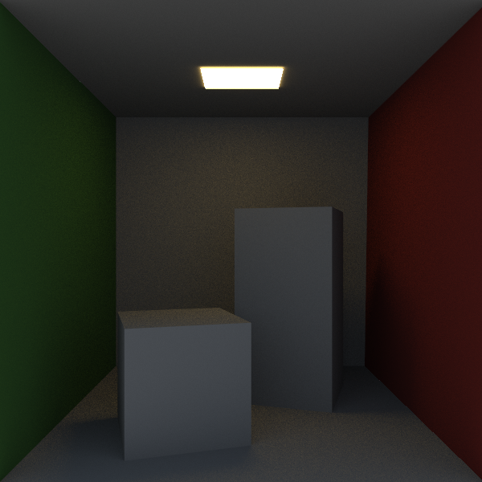
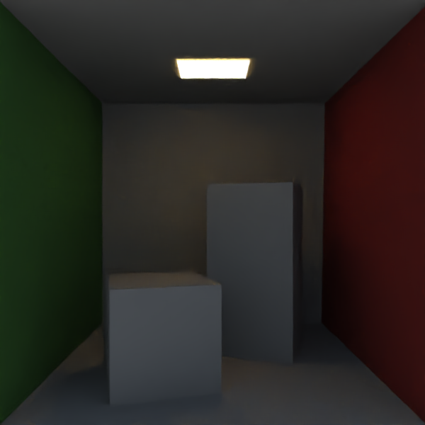

# Rusteray
|  |
|:--:| 
| 00:07:36 - 2000 samples per pixel |

Rusteray, a physically based path tracer written in Rust.

## Features
- [X] BRDF support: Lambertian, Oren-Nayar 
- [X] Multithreaded with a threadpool
- [X] Denoising support via [Intel OpenImageDenoise](https://github.com/OpenImageDenoise/oidn)
- [X] JSON config 
- [X] gltf2 model support

## Showcase
|  |
|:--:| 
| ~00:00:08 - 10 samples per pixel |

|  |
|:--:| 
| ~00:00:16 - 10 samples per pixel, denoised, no aux buffers | 

## TODOs
- .gltf2 scene support?
    - config.json
        - frames to render
        - samples per ray
        - denoising or not
        - windows size
        - scene background color
          - scene background color gradient?
          - scene background atmosphere modeling?
    - scene to load?
    - BRDFs on which model (mapping)?
- Explicit light sampling / next event estimation 
- Diffuse & Specular BRDF support on materials?
    - Unify BSDF = BRDF + BTDF?
    - Bi-directional Transmission Distribution Function support (BTDF)?
    - Subsurface scattering BRDF support?
    - Model volume support
- Russian roulette termination (min bounds?)

## Config.json documentation
```json
{
    "progress_bar": true,
    "denoise": false,
    "window_width": 600,
    "window_height": 600,
    "frames_to_render": 20,
    "quit_after_render": false,
    "save_rendered_image_path": "",                          // NOTE: Relative to the executable
    "ray_samples_per_pixel": 25,
    "ray_max_depth": 10,
    "scene_paths": ["/models/cornell_box/cornell_box.obj"],  // NOTE: Relative to the executable
    "scene_background_color": [0.5, 0.7, 1.0],               // NOTE: RGB format [0, 1.0]
    "camera_position": [0.0, 1.0, 3.1],
    "camera_direction": [0.0, 1.0, 0.0],
    "camera_fov": 50.0                                       // NOTE: Degrees
}
```
Example of default value config.

## References
- [Ray Tracing: In One Weekend](https://in1weekend.blogspot.com/) by Peter Shirley.
- Real-Time Rendering 4th edition by Akenin-Möller, Haines, et al.
- Physically Based Rendering by Matt Pharr.
- Oren-Nayar BRDF [publication](http://www1.cs.columbia.edu/CAVE/publications/pdfs/Oren_SIGGRAPH94.pdf)

## License
MIT License

Copyright (c) 2020 Alexander Lingtorp

Permission is hereby granted, free of charge, to any person obtaining a copy
of this software and associated documentation files (the "Software"), to deal
in the Software without restriction, including without limitation the rights
to use, copy, modify, merge, publish, distribute, sublicense, and/or sell
copies of the Software, and to permit persons to whom the Software is
furnished to do so, subject to the following conditions:

The above copyright notice and this permission notice shall be included in all
copies or substantial portions of the Software.

THE SOFTWARE IS PROVIDED "AS IS", WITHOUT WARRANTY OF ANY KIND, EXPRESS OR
IMPLIED, INCLUDING BUT NOT LIMITED TO THE WARRANTIES OF MERCHANTABILITY,
FITNESS FOR A PARTICULAR PURPOSE AND NONINFRINGEMENT. IN NO EVENT SHALL THE
AUTHORS OR COPYRIGHT HOLDERS BE LIABLE FOR ANY CLAIM, DAMAGES OR OTHER
LIABILITY, WHETHER IN AN ACTION OF CONTRACT, TORT OR OTHERWISE, ARISING FROM,
OUT OF OR IN CONNECTION WITH THE SOFTWARE OR THE USE OR OTHER DEALINGS IN THE
SOFTWARE.
