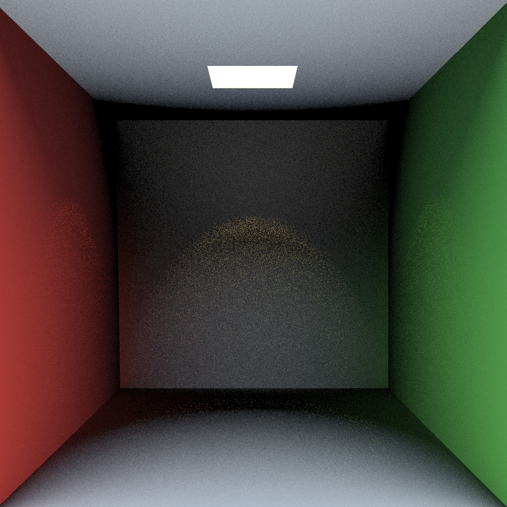

# Rusteray

Rusteray - a work in progress physically based path tracer written in Rust.

# References
- [Ray Tracing: In One Weekend](https://in1weekend.blogspot.com/) by Peter Shirley.
- Real-Time Rendering by Akenin-Möller, Haines, et al.
- Physically Based Rendering by Matt Pharr.

# License
